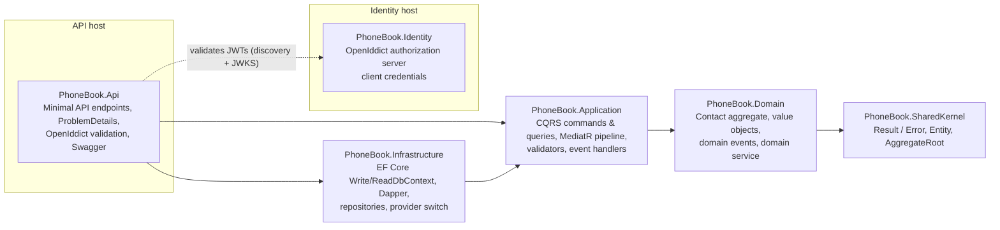
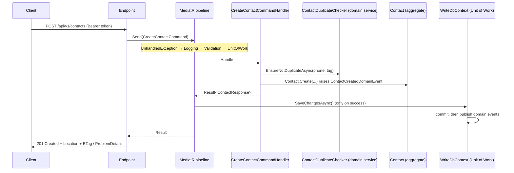

# PhoneBook: Backend Assignment (.NET 10)

[](https://github.com/PooriaGh/PhoneBook/actions/workflows/ci.yml)


> **Cover letter** for the backend developer assignment of **Hasin Group (گروه حصین)**.
> This README explains the architecture, the technology choices, how to run and test the solution, and the
> development process (spec-driven development with AI assistance).

---

## 1. Cover note

Dear reviewer,

Thank you for the assignment. The brief asks for a small phone book. I treated it as a chance to show how I
build a production-style backend: a clear domain model, explicit error handling, well-defined read and write
paths, real security and tests that prove every requirement. The scope is kept small and every pattern is
used for a reason. The reasons are written down in [`specs/001-phonebook-management/research.md`](specs/001-phonebook-management/research.md),
and the most important trade-offs are in section 13.

The whole project was built **spec-first** with GitHub Spec Kit and **AI pair-programming** (Claude Code).
Every AI-generated artefact was reviewed and accepted only when the tests passed. Section 12 describes the
process honestly, including the problems it caught before any code was written.

---

## 2. The brief, and where each item is implemented

> یک دفترچه تلفن را با استفاده از DotNet Core پیاده سازی کنید که امکانات زیر را دارا است:
> ● اضافه کردن یک ردیف به دفتر تلفن، دارای نام و نام خانوادگی، شماره تلفن و یک برچسب به خصوص مثلاً «شماره همکارم در ترابرنت»
> ● تغییر یکی از ردیف‌های درون دفتر تلفن ● گرفتن تمامی ردیف‌هایی که برچسب (Tag) خاصی را دارند ● حذف یکی از ردیف‌های دفتر تلفن
> پروژه را تا جای ممکن با رعایت قوانین DDD پیاده کنید … همه چیز می‌تواند به صورت In Memory نگهداری شود.
> تمامی APIها به صورت RESTful طراحی شوند و با استفاده از Swagger در دسترس قرار بگیرند.

| Brief item | Endpoint | Spec |
|---|---|---|
| Add an entry (name, surname, phone, tag) | `POST /api/v1/contacts` → `201` + `Location` + `ETag` | US1, FR-001…FR-005, FR-018 |
| Edit an entry | `PUT /api/v1/contacts/{id}` (optional `If-Match`) → `200` | US3, FR-006, FR-007, FR-017 |
| Get all entries with a tag | `GET /api/v1/contacts?tag=…` → `200 [...]` | US2, FR-008, FR-009 |
| Delete an entry | `DELETE /api/v1/contacts/{id}` (optional `If-Match`) → `204` | US4, FR-010, FR-011 |
| (support) Read one entry | `GET /api/v1/contacts/{id}` → `200` + `ETag` | used by `Location` |
| DDD | `Contact` aggregate, value objects, domain events, domain service | §4 |
| In-memory storage | in-memory SQLite (default provider) | §7 |
| RESTful + Swagger | versioned routes, ProblemDetails, OAuth-enabled Swagger UI | §6, §8 |
| Tests | unit + integration + architecture + load/perf | §10 |
| Cover letter | this README | |

The full specification (user stories, acceptance scenarios, edge cases) is in
[`specs/001-phonebook-management/spec.md`](specs/001-phonebook-management/spec.md).

---

## 3. Architecture

Clean Architecture with DDD tactical patterns. Dependencies point inwards, and **architecture tests enforce this**.



**The command path** (for example, `POST /contacts`):



| Project | Responsibility |
|---|---|
| `PhoneBook.SharedKernel` | `Result`/`Result<T>`, `Error`, `ValidationError`, `Entity`, `AggregateRoot`, `IDomainEvent` |
| `PhoneBook.Domain` | `Contact` aggregate, `ContactId`/`PersonName`/`PhoneNumber`/`Tag` value objects, events, `ContactDuplicateChecker` |
| `PhoneBook.Application` | Commands, queries, handlers, validators, pipeline behaviours, domain-event handlers |
| `PhoneBook.Infrastructure` | `WriteDbContext` (UoW), `ReadDbContext`, Dapper connection factory, repositories, provider switch |
| `PhoneBook.Api` | Endpoints (`IEndpoint` discovery), error mapping, ETags, auth policies, Swagger |
| `PhoneBook.Identity` | Separate OpenIddict server: token endpoint, seeding, CORS for Swagger |

---

## 4. The DDD model

**Aggregate root: `Contact`.** Each contact is its own consistency boundary. A single "PhoneBook" aggregate
holding every contact would be a large-aggregate anti-pattern.

| Element | Kind | Invariants |
|---|---|---|
| `ContactId` | value object (GUID v7) | not empty |
| `PersonName` | value object | first/last name trimmed, not blank, ≤ 100 chars, full Unicode (Persian, ZWNJ) |
| `PhoneNumber` | value object | Persian/Arabic-Indic digits → ASCII; optional leading `+`; digits, spaces and `-` only; 4–15 digits; stored normalized |
| `Tag` | value object | trimmed, not blank, ≤ 50 chars; equality ignores letter case (`NormalizedValue`) |
| `Contact.Create / Update / MarkAsDeleted` | behaviour | `Version` for optimistic concurrency; identical update = no-op |

**Domain events:** `ContactCreated`, `ContactUpdated`, `ContactTagChanged` (raised only for a real tag change,
not a change in letter case) and `ContactDeleted`. They are published **after commit**, through a MediatR
adapter, so the Domain has no MediatR dependency.

**Domain service `ContactDuplicateChecker`:** "the same phone number cannot be registered twice under the same
tag" (FR-018). This is the one rule that spans aggregates, so it lives in a domain service behind a
domain-owned port (`IContactUniquenessReader`). A unique index backs it up in case of a race.

---

## 5. CQRS: separate read and write paths

| | Write side | Read side |
|---|---|---|
| Access | `IContactRepository` + `IUnitOfWork` (`WriteDbContext`) | `IReadDbContext` (EF, no tracking) **and** Dapper |
| Model | `Contact` aggregate | flat read models / DTOs |
| Used by | Create, Update, Delete commands | `GetContactById` (EF LINQ projection), `GetContactsByTag` (Dapper SQL) |
| Commit | `UnitOfWorkBehavior` after a successful handler | never; `ReadDbContext.SaveChanges` is a logged no-op |

Both read technologies are used on purpose. EF no-tracking projections cover simple lookups, and hand-written
parameterised SQL through Dapper serves the hot tag search. The SQL is portable (no `ORDER BY`): SQLite and
PostgreSQL collate Persian text differently, so results are sorted in memory by character code, which
makes the order identical on both providers.

---

## 6. Error handling: the Result pattern and two safety nets

* **No exceptions for expected failures.** Value objects, aggregates, the domain service, validators and
  handlers all return `Result`/`Result<T>` with a typed `Error(Code, Description, ErrorType)`. Validation
  failures carry **per-field** errors (`ValidationError` → `FieldError`).
* **Validators call the domain factories** (they do not copy the rules), so both always report the same
  error codes, and every invalid field is reported at once.
* **Safety net 1:** `UnhandledExceptionBehavior` (MediatR) turns any exception inside the pipeline into
  `General.Unexpected`.
* **Safety net 2:** `GlobalExceptionHandler` (`IExceptionHandler`) turns anything else into a `500`
  ProblemDetails. Exception details appear only in Development.
* **Every API error is RFC 9457 ProblemDetails** with `errorCode` and `traceId`, including `401`/`403`/`404`/`405`
  raised by the framework and real OpenIddict challenges.

| `ErrorType` | HTTP | Example `errorCode` |
|---|---|---|
| Validation | 400 | `General.Validation` (with `errors.{field}`), `Contact.Id.Invalid` |
| NotFound | 404 | `Contact.NotFound` |
| Conflict | 409 | `Contact.Duplicate`, `Contact.ConcurrencyConflict` |
| PreconditionFailed | 412 | `Contact.VersionMismatch` (stale `If-Match`) |
| Unexpected | 500 | `General.Unexpected` |
| (framework) | 401 / 403 | `Auth.Unauthorized` / `Auth.Forbidden` |

**Concurrency:** `version` is an EF concurrency token and is exposed as an `ETag`. `PUT`/`DELETE` accept `If-Match`
(a mismatch returns `412`), and a lost race returns `409`. Tests fire 10 simultaneous `PUT`s and 20 identical
`POST`s at the API and assert exactly one winner, with no `5xx`.

---

## 7. Persistence: in memory, with a real SQL engine

The brief asks for in-memory storage. The EF Core **InMemory** provider cannot run SQL, so Dapper would not
work, and it cannot be reset by Respawn or run in Testcontainers. The solution uses a **provider switch**
(`Database:Provider`):

| Provider | Used for | Notes |
|---|---|---|
| `Sqlite` (default) | running the app | shared-cache **in-memory** database, kept alive by a singleton connection; nothing is written to disk; writes are serialized by a `SqliteWriteGate` |
| `Postgres` | integration tests (Testcontainers + Respawn), optional compose profile | same schema, same SQL |

The schema is created with `EnsureCreated()` (migrations make no sense for a database that disappears on
restart). The two indexes (`ix_contacts_normalized_tag`, unique `ux_contacts_phone_tag`) are portable SQL.

---

## 8. Security: separate OpenIddict identity server

* `PhoneBook.Identity` is a **separate host** running **OpenIddict 7** with EF Core stores in its own
  in-memory SQLite database.
* It uses the **OAuth 2.0 client-credentials** grant (the API is machine-to-machine; there are no end users in the spec).
* **Scopes:** `phonebook.read` (GET) and `phonebook.write` (POST/PUT/DELETE), enforced by the API policies
  `Contacts.Read` and `Contacts.Write`. The audience is `phonebook-api`.
* The issuer is fixed by configuration (`Identity:Issuer`). The API validates signed JWTs using the discovery
  document and JWKS.
* A CORS policy allows the Swagger UI (on the API origin) to call `/connect/token`.
* The malformed-id fallback route also requires authentication. Only `/health/*` and `/swagger` are anonymous.

**Development clients (DEV-ONLY credentials, in `src/PhoneBook.Identity/appsettings.Development.json`):**

| client_id | secret | scopes |
|---|---|---|
| `phonebook-swagger` | `phonebook-swagger-dev-secret` | read, write |
| `phonebook-readonly` | `phonebook-readonly-dev-secret` | read (demonstrates `403`) |

**Production notes:** use X.509 signing and encryption certificates instead of ephemeral keys, store secrets in
a vault, persist the OpenIddict store, and add authorization code + PKCE if end users are ever introduced.

---

## 9. Technologies

| Package | Why |
|---|---|
| .NET 10 (LTS), C# 14 | current LTS; nullable enabled, warnings are errors, Central Package Management |
| ASP.NET Core Minimal APIs + `Asp.Versioning` | lean endpoints discovered via `IEndpoint`, URL versioning `/api/v1` |
| **MediatR 12.5.0** | CQRS pipeline. **Pinned deliberately:** later versions require a commercial license key |
| FluentValidation | request validation that delegates to the domain rules |
| EF Core 10 (SQLite, Npgsql) + EFCore.NamingConventions | write model and read models, snake_case schema, complex properties for value objects |
| Dapper | hand-written read-side SQL |
| OpenIddict 7 | standards-based OAuth 2.0 server and token validation (Apache 2.0) |
| Swashbuckle | Swagger UI with the OAuth2 client-credentials flow |
| Serilog | structured logging and request logging; hot paths use `[LoggerMessage]` source generation |
| xUnit v3 + Microsoft.Testing.Platform | test framework and runner (required by the .NET 10 SDK) |
| **Shouldly** | assertions. Chosen over FluentAssertions 8+, which is commercially licensed |
| NSubstitute, Bogus | a test double for the domain-service port; Persian-locale fake data |
| Testcontainers.PostgreSql + Respawn | a real PostgreSQL per test run, reset between tests |
| NetArchTest.Rules | enforces the layer dependency rules |

---

## 10. Testing strategy

**Result of the final run** (`dotnet build -c Release` with 0 warnings; `dotnet test --solution PhoneBook.slnx -c Release`):
**132 tests, 132 passed, 0 failed.**

| Project | Tests |
|---|---|
| Domain unit tests | 45 |
| API integration tests (PostgreSQL + in-memory SQLite) | 67 |
| Identity integration tests (incl. end-to-end) | 12 |
| Architecture tests | 8 |

| Project | Kind | What it proves |
|---|---|---|
| `PhoneBook.Domain.UnitTests` | unit | **only domain business rules**: value objects, aggregate behaviour and events, the domain service |
| `PhoneBook.Api.IntegrationTests` | integration | commands and queries (through `ISender`), every HTTP endpoint, auth policies, ETags, ProblemDetails, concurrency, **on PostgreSQL (Testcontainers + Respawn) and in-memory SQLite** |
| `PhoneBook.Identity.IntegrationTests` | integration | discovery, token endpoint errors, CORS, and an **end-to-end** test: a real token from the Identity host is validated by the API's real OpenIddict validation |
| `PhoneBook.ArchitectureTests` | architecture | layer dependencies, CQRS separation (query handlers never touch the write side), naming rules |

* **Test-first:** every user story's tests were written first and seen to fail (they did not compile, which
  counts as red) before the implementation.
* **Both providers:** a SQLite smoke suite, a mixed-load test and a performance test run against the default
  in-memory SQLite database as well as PostgreSQL.
* **SC-004 performance:** a tag search over 10,000 contacts takes under 1 second on both providers.
* **SC-005 consistency:** 100 concurrent create/update/delete/search requests produce no `5xx`, the expected
  row count, every updated row at `version == 2`, and no duplicates.
* **End-to-end design note:** the end-to-end test gives the API the Identity host's real issuer and signing
  keys (read from its discovery and JWKS documents) instead of swapping HTTP handlers. Token validation is
  genuine, and the test needs no network. The live HTTP discovery path (the API fetching the Identity host's
  discovery document and JWKS over HTTPS) was exercised by the quickstart run in §11 (17/17).

```bash
dotnet test --solution PhoneBook.slnx                                  # everything (Docker must be running)
dotnet test --project tests/PhoneBook.Domain.UnitTests                 # one project
dotnet test --solution PhoneBook.slnx -c Release --report-trx --coverage   # what CI runs
```

The .NET 10 SDK runs tests on **Microsoft.Testing.Platform** (`global.json` → `"test": { "runner": … }`), so
filters use `--filter-class` / `--filter-method` / `--filter-query` instead of VSTest's `--filter`. TRX and
coverage reports come from the `Microsoft.Testing.Extensions.TrxReport` and `…CodeCoverage` packages and are
written to `./TestResults`.

**Continuous integration:** [`.github/workflows/ci.yml`](.github/workflows/ci.yml) restores, builds in Release
with warnings as errors, and runs the whole suite on `ubuntu-latest`. Testcontainers uses the runner's Docker
daemon. The TRX and coverage files are uploaded as build artefacts.

---

## 11. How to run

**Prerequisites:** .NET SDK 10.0.4xx, Docker Desktop (for the integration tests and compose), a trusted dev
certificate (`dotnet dev-certs https --trust`).

```bash
git clone https://github.com/PooriaGh/PhoneBook.git && cd PhoneBook
dotnet run --project src/PhoneBook.Identity --launch-profile https   # https://localhost:7002
dotnet run --project src/PhoneBook.Api --launch-profile https        # https://localhost:7001/swagger
```

1. Open `https://localhost:7001/swagger`, click **Authorize**, and use client `phonebook-swagger` /
   `phonebook-swagger-dev-secret` with both scopes.
2. Try the endpoints. The full validation walkthrough (17 scenarios) is in
   [`specs/001-phonebook-management/quickstart.md`](specs/001-phonebook-management/quickstart.md).

**Quickstart validation checklist:** all 17 scenarios of quickstart §3 were executed against both hosts running
locally over HTTPS, with real tokens from the Identity host: **17/17 passed**.

- [x] 1–5: create, duplicate (409), same phone under another tag, Persian digits, per-field validation errors
- [x] 6–8: case/space-insensitive tag search, empty result `[]`, blank tag → 400
- [x] 9–12: update with `ETag`/`If-Match`, stale `If-Match` → 412, tag move, unknown id → 404
- [x] 13–14: malformed id → 400 (401 when anonymous), delete → 204 then 404
- [x] 15–16: no token → 401 ProblemDetails + `WWW-Authenticate`; read-only client → 403
- [x] 17: ordinal ordering (`احمدی` before `رضایی`)
- [x] CORS preflight from the API origin allowed, other origins refused; Swagger `tokenUrl` = Identity `/connect/token`
- [x] Swagger UI **Authorize** click-through in a browser (dev client secret entered by hand)

**Docker Compose:**

```bash
docker compose up --build                       # API http://localhost:7001/swagger, Identity http://localhost:7002
docker compose --profile postgres up --build    # adds an API on PostgreSQL at http://localhost:7003
```

**Compose smoke test (T126): 14/14 checks passed** on both profiles:
- the Identity container issues tokens over plain HTTP with the fixed issuer `http://identity:8080/`
- both API containers (in-memory SQLite on `:7001`, PostgreSQL on `:7003`) validate those tokens via HTTP
  discovery, create a contact (`201`) and find it by tag
- a request without a token gets a `401` ProblemDetails
- Swagger's `tokenUrl` is the browser-reachable `http://localhost:7002/connect/token`
- the CORS preflight from `http://localhost:7001` is allowed

Both images are multi-stage builds that run as the non-root `app` user.

Data lives in memory (by design) and is gone after a restart.

---

## 12. Development process: spec-driven, AI-assisted

### Spec-Driven Development with GitHub Spec Kit

The work followed the Spec Kit flow. Each step produced a reviewable artefact in [`specs/`](specs/001-phonebook-management):

1. **`/speckit-specify`** turned the Persian PDF brief into [`spec.md`](specs/001-phonebook-management/spec.md):
   four prioritized user stories, acceptance scenarios, edge cases (Persian text and digits, case-insensitive
   tags, malformed ids, concurrency), 19 functional requirements and 6 measurable success criteria.
2. **`/speckit-plan`** produced [`plan.md`](specs/001-phonebook-management/plan.md),
   [`research.md`](specs/001-phonebook-management/research.md) (18 recorded decisions with alternatives),
   [`data-model.md`](specs/001-phonebook-management/data-model.md), the
   [contracts](specs/001-phonebook-management/contracts) (OpenAPI and the token endpoint) and
   [`quickstart.md`](specs/001-phonebook-management/quickstart.md).
3. **`/speckit-constitution`** ratified a [project constitution](.specify/memory/constitution.md) with seven
   principles (DDD, the Result pattern, two safety nets, CQRS, test discipline, secure by default,
   spec-driven delivery) and quality gates.
4. **`/speckit-tasks`** produced [`tasks.md`](specs/001-phonebook-management/tasks.md) (124 tasks, ordered
   test-first; 130 after the convergence phase).
5. **`/speckit-analyze`** was run repeatedly. It checks the spec, plan, tasks and constitution against each other.
6. **`/speckit-implement`** executed the tasks phase by phase. Each checkpoint required a green full test
   suite and a 0-warning Release build.
7. **`/speckit-converge`** compared the finished code with the spec, plan, tasks and constitution. It
   appended the remaining work as a *Convergence* phase (T125–T130), which was then implemented (see below).

### What the analysis caught before any code was written

| Finding | What was wrong | Fix |
|---|---|---|
| C1 (critical) | the default in-memory SQLite provider had no integration tests | SQLite factory + smoke, load and performance suites |
| U1 | Swagger "Authorize" would fail: the Identity host had no CORS | CORS policy + tests |
| I1 | both hosts define a global `Program`, so a test project referencing both would not compile | `ApiAssemblyMarker` / `IdentityAssemblyMarker` |
| K1 (critical) | domain tests were planned *after* the domain code | domain tests moved first in Phase 2 |
| K3 (critical) | the malformed-id route allowed anonymous access | `.RequireAuthorization()` + a 401 test |
| P1 / P2 | SQLite and PostgreSQL order Persian text differently; SQLite shared-cache write locks | ordinal in-memory sort; `SqliteWriteGate` |
| A3 | constitution Principle III was ambiguous about health checks and OAuth errors | constitution **v1.0.1** (PATCH amendment) |

### What convergence caught after implementation

| Finding | What was wrong | Fix |
|---|---|---|
| CI (T125) | the first GitHub Actions run failed: `--report-trx --coverage` needs Microsoft.Testing.Platform extensions, so zero tests ran | added `Microsoft.Testing.Extensions.TrxReport` and `CodeCoverage`; the same command passes locally (132/132) |
| T127 | `Auth:RequireHttpsMetadata` was bound but had no effect (OpenIddict 7 has no such switch) | option removed |
| T128 | an unused health-check package was declared | removed |
| T130 | two deliberate deviations from the task wording were explained only in this README | recorded in `research.md` R-18 |
| T126 | the Docker Compose stack had never been run | built and smoke-tested on both profiles (14/14) |
| T129 | the in-browser Swagger "Authorize" flow had not been verified (it needs the dev client secret entered by hand) | walked through in the browser |

### AI-assisted engineering (Claude Code)

* **What the AI drafted:** the spec from the Persian brief, the research options, the task breakdown, and first
  drafts of most code and tests.
* **What stayed human:** the key decisions: the persistence strategy (in-memory SQLite plus PostgreSQL instead
  of the EF InMemory provider), adding the duplicate rule as a genuine domain service, client-credentials
  instead of a login UI, and the licensing pins (MediatR 12.5.0, Shouldly).
* **How the output was verified:** nothing was accepted on trust. Every task had to pass a test written before
  it. Each phase ended with the full suite on both providers plus a 0-warning build. Library APIs that had
  changed (the OpenIddict 7 event model, Swashbuckle 10 / Microsoft.OpenApi v2, the .NET 10 test runner) were
  checked against the installed packages or documentation instead of guessed.
* **Reconciled during implementation** (constitution Principle VII, "specs are the source of truth"):
  * OpenIddict answers a permitted-but-not-granted scope with `invalid_request` (not `invalid_scope`), so the
    token contract was corrected.
  * `PhoneNumber.TooLong` and `General.Error` were added to the data model's error table.
  * The architecture rule was narrowed to "no provider drivers in Application", because Dapper belongs to the
    read side there.
  * The end-to-end test uses static issuer configuration (see §10).
  * Validators call the domain value-object factories instead of repeating the rules (`research.md` R-18).
  * `Auth:RequireHttpsMetadata` was removed, because OpenIddict 7 validation accepts HTTP and HTTPS URLs and
    offers no such switch.

---

## 13. Trade-offs and future work

* **Transactional outbox:** events are published in-process after commit. If the process crashes between
  commit and publish, events are lost. Acceptable for audit logging here; an outbox is the production answer.
* **Projected read store:** reads and writes share one table. A separate projection updated by events would
  give fully independent read scaling.
* **Persistent database + migrations:** switch `Database:Provider` to `Postgres` and replace `EnsureCreated`
  with EF migrations.
* **Pagination** for large tag results, **rate limiting**, **OpenTelemetry** traces and metrics, and
  **authorization code + PKCE** once end users exist.
